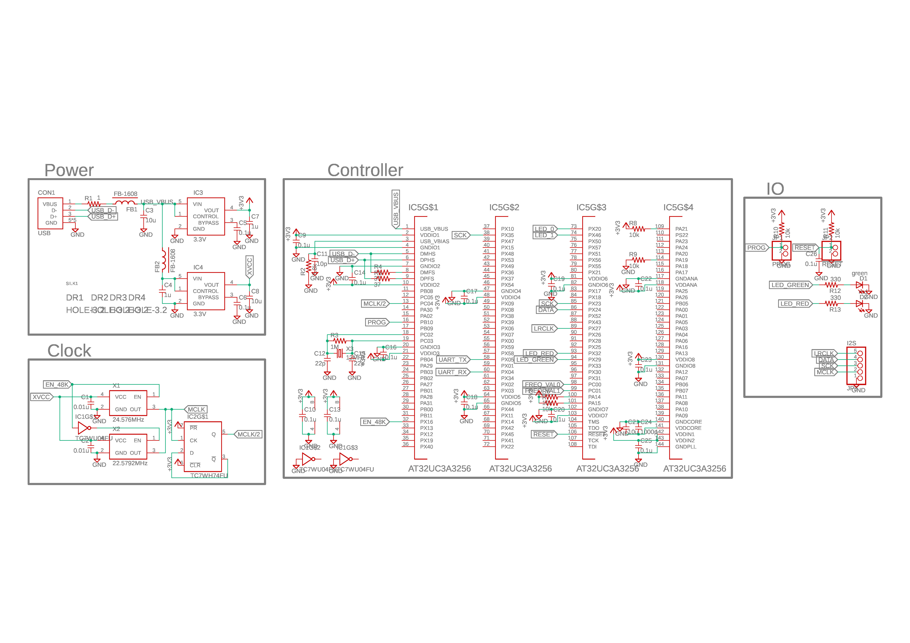
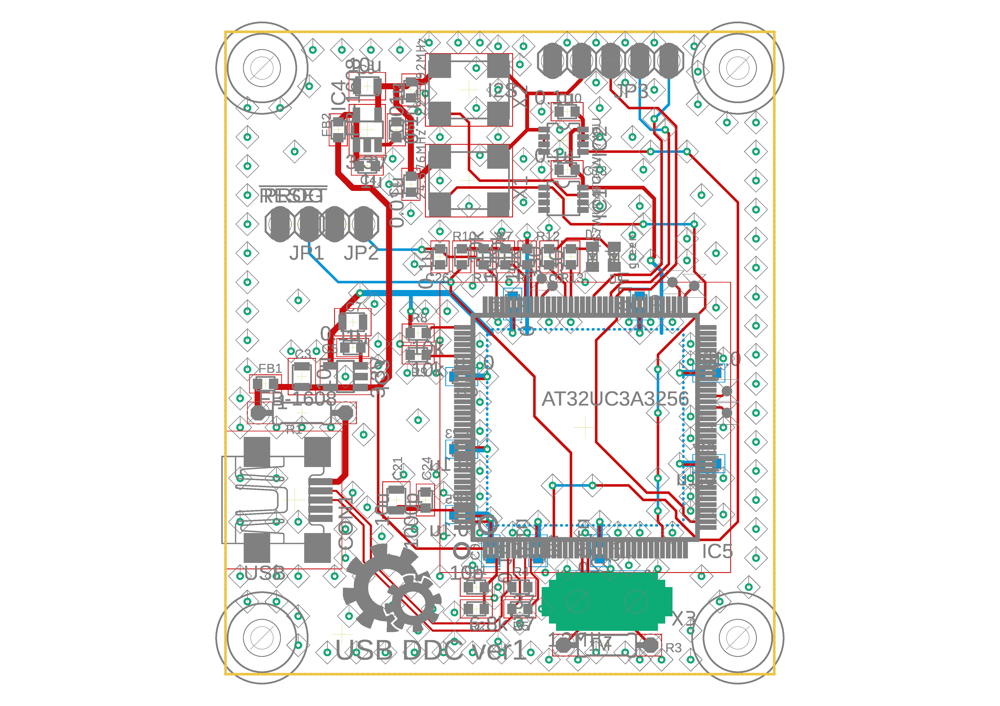

This circuit is a USB to I2S converter.
* Firmware and further description is [here](https://github.com/tarori/Firmware.USB-DDC.git).
* [Latest version](https://github.com/tarori/Circuit.USB-DAC).
* .sch and .brd are EAGLE cad file.

